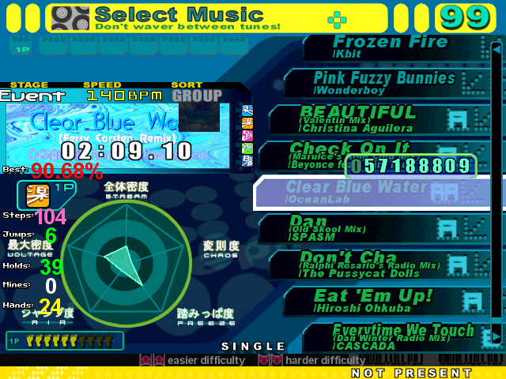

# Instructions
1. Replace `Themes\default\metrics.ini` file with one of the following:
  * If using the Plus Redux mod, use `metrics-plus-version.ini`
  * If using the vanilla 3.9 version, use `metrics-non-plus-version.ini`
2. Copy the `Graphics` folder as well.

Note: If radar is all maximized, try deleting the `Cache` directory of the installation directory and reload StepMania.

## Changes
Look for `MOD` in the files. Basically, the changes were:
* Display song length
* Display score as percentage
* Display a panel that provides statistics on the course (nubmer of steps, jumps, etc)

